# The Ocean Breeze

"Welcome to the Ocean Breeze! A cozy restaurant located by the shore with amazing, fresh food with freshly caught fish and seafood."

LIVE WEBSITE

You can view a live version of the website here.(<https://young-anchorage-44026-d8f70dc45a2a.herokuapp.com/>)

GITHUB PAGES

You can view the GitHub code pages here. (<https://github.com/Jesper941/OceanBreez>)

## CONTENTS

- [The Ocean Breeze](#the-ocean-breeze)
  - [CONTENTS](#contents)
      - [Visitors Goals](#visitors-goals)
      - [First-Time Visitor Goals](#first-time-visitor-goals)
      - [Returning Visitor Goals](#returning-visitor-goals)
      - [Frequent Visitor Goals](#frequent-visitor-goals)
  - [Strategy](#strategy)
    - [Sets Of Goals](#sets-of-goals)
      - [Set Of Goals 1 - Initial Setup](#set-of-goals-1---initial-setup)
      - [Set Of Goals 2 - Templates](#set-of-goals-2---templates)
      - [Set Of Goals 3 - Booking System](#set-of-goals-3---booking-system)
      - [Set Of Goals 4 - CRUD Aspect Of The Booking System](#set-of-goals-4---crud-aspect-of-the-booking-system)
  - [Scope](#scope)
  - [Design](#design)
    - [Colour Scheme](#colour-scheme)
    - [Typography](#typography)
    - [Function Styling](#function-styling)
  - [Implementations \& Accessability](#implementations--accessability)
    - [Future Implementations](#future-implementations)
    - [Accessibility](#accessibility)
  - [Technologies Used](#technologies-used)
    - [Languages Used](#languages-used)
    - [Local Development](#local-development)
      - [How to Fork](#how-to-fork)
      - [How to Clone](#how-to-clone)
  - [Testing](#testing)
  - [Credits](#credits)
    - [Code Used](#code-used)
    - [Content](#content)
    - [Media](#media)
    - [Feedback](#feedback)

---

#### Visitors Goals

The main goal for any visitor would be to test their knowledge of the history of the National Hockey League and its players.
Another goal is to see who's the most knowledgeable among their friends or family members.
To spend some time having fun with an interactive and interesting quiz.
Divided into different categories, the visitor's goals may look like this:

#### First-Time Visitor Goals

- I want to see what kind of food the restaurant has to offer.
- I want to see where the restaurant is located.
- I want to know how to get in contact with the restaurant.
- I want to be able to book a table either via phone or through the website.
- I want to be able to register to the booking feature easily.
- I want the booking system to be smooth and easy to use.

#### Returning Visitor Goals

- I want to be able to change my booking.
- I want to be able to change the information in my current booking.
- I want to see if the restaurant have anything new on the menu since visiting last.

#### Frequent Visitor Goals

- I want to be able to have multiple bookings at the same time
- I want to be able to chose which booking i want to change if i have more than one.

---

## Strategy

### Sets Of Goals

This project was developed with 5 milestones (epics) in mind. From each of these milestones a number of dev goals and user stories were created, each one given a prioritisation using the MoSCoW method. The detail of these milestones, goals and stories is outlined below.

#### Set Of Goals 1 - Initial Setup

- Goal 1 -Install Flask, Django and any other library necessary to complete the project.
- Goal 2 - Make sure the "manage.py runserver" command works and that the website can go live
- Goal 3 - Create all the necessary folders such as "templates", "bookings" and "static"

#### Set Of Goals 2 - Templates

- Goal 1 - Set up a base, an index landing page, a menu page, a contact page and a booking page
- Goal 2 - Fill each page with the content i wanted it to have
- Goal 3 - Make sure the pages are estethically pleasing and responsive

#### Set Of Goals 3 - Booking System

- Goal 1 - Add the registration and login form to the booking page
- Goal 2 - Set up all the necessary steps for the admin site
- Goal 3 - Create the models needed to have both user registration and bookings possible and be uploaded to the database
- Goal 4 - Ensure that admins can create, edit or cancel any booking or delete any user if needed

#### Set Of Goals 4 - CRUD Aspect Of The Booking System

- Goal 1 - Allow the users to register to the website
- Goal 2 - Allow the user to book a table once they've registered
- Goal 3 - Allow the user to chose date, time, what name to book the table in and to add some contact information
- Goal 4 - Allow the user to make multiple bookings
- Goal 5 - Allow the user to select an existing booking and edit/add/remove information from the booking.
- Goal 6 - Allow the administrator to cancel, reschedule or edit all any booking
- Goal 7 - Allow the administrator to edit or delete registered users
- Goal 8 - Allow users to cancel their bookings

## Scope

So with all of these user stories and developing goals in mind, the list of things that i wanted and that were necessary ended up as such:

- A responsive website that's usable on any modern device
- An easily navigatable website that's user friendly and not too bulky with uneccessary content
- Main pages such as:
  - An index / homepage with information about the restaurant and it's history
  - A menu page where the users can inspect the food that's being served before deciding to book a table
  - A contact page where users can find the restaurant's location and contact information
  - A table booking page where users can register in order to book, view, edit, cancel or add information to their booking
- An admin site where the administrators can create, edit or remove bookings
- An admin site where the administrators can create, edit or delete registered users

## Design

### Colour Scheme

Here is the color palette for the colors that I've used to create this website.

### Typography

I use the 'Lora', 'Times New Roman' and 'serif' font style for the entire website.

### Function Styling

- Starting off with the home page where the visitor can read about the history of the Ocean Breeze.

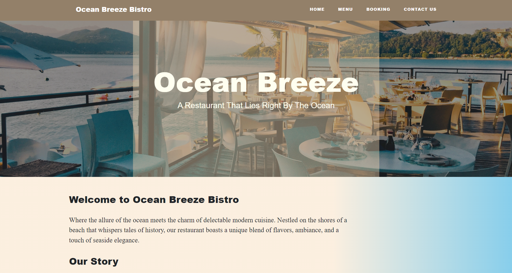

- The menu page where visitors can take a glance at the menu before visiting the restaurant.

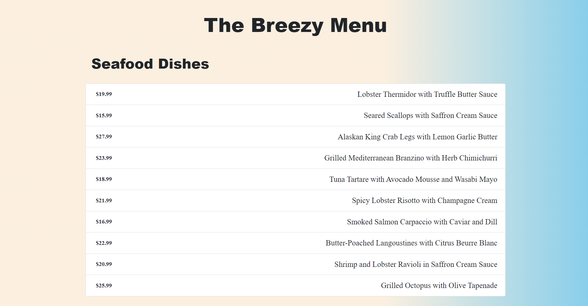

- In the contact page, this is where the visitors can find the restaurants location and opening hours.

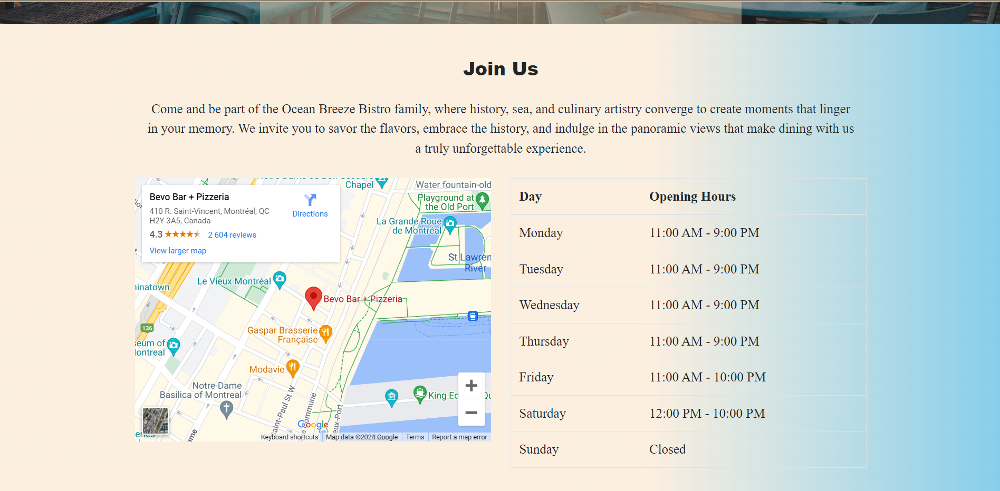

Here is the contact form at the bottom of the contact page where visitors can send in any questions they may have.

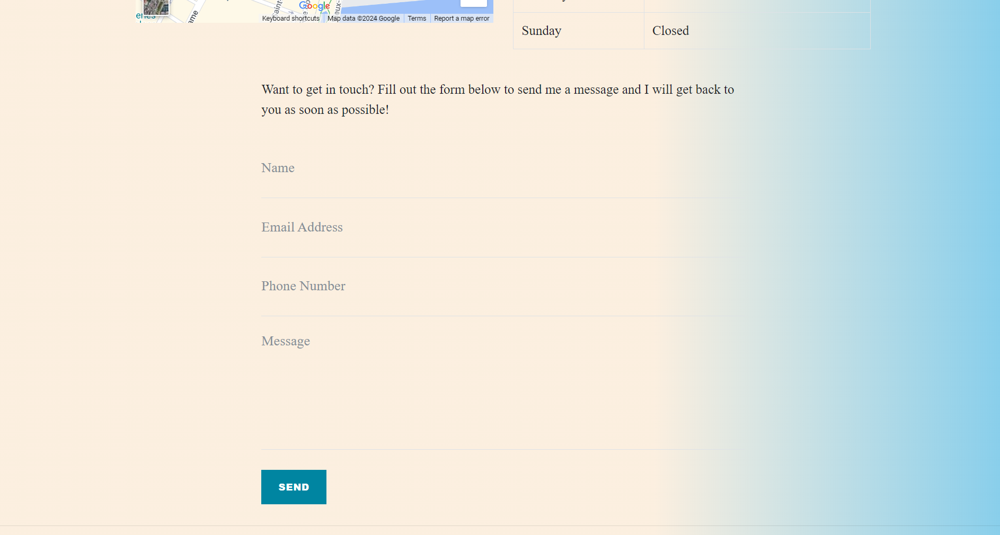

- Here is the booking page where you can chose to login to your account, or register a new account.

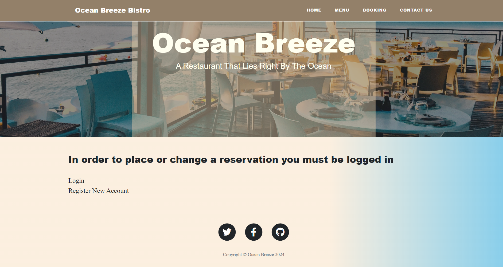

- If you press the link to register a new account, it will bring you to the account creation page.

  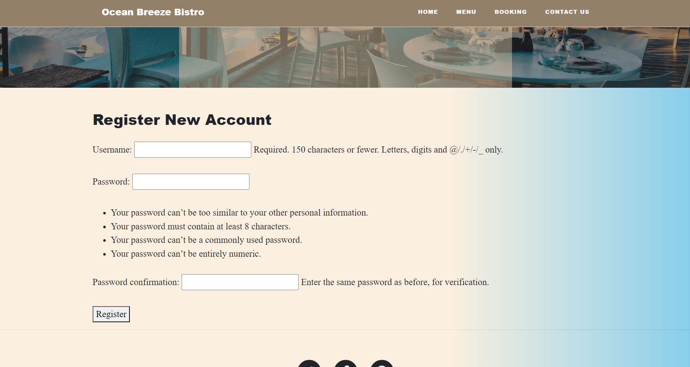

- If you press to link to login, it will bring you to the login page.

  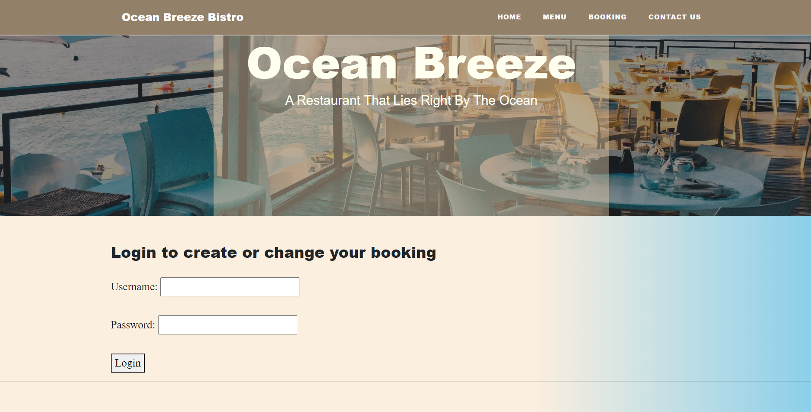

- Once you've created a new account or logged into your existing account, it will bring you to this page where you can make a booking for a table, or change an existing booking.

  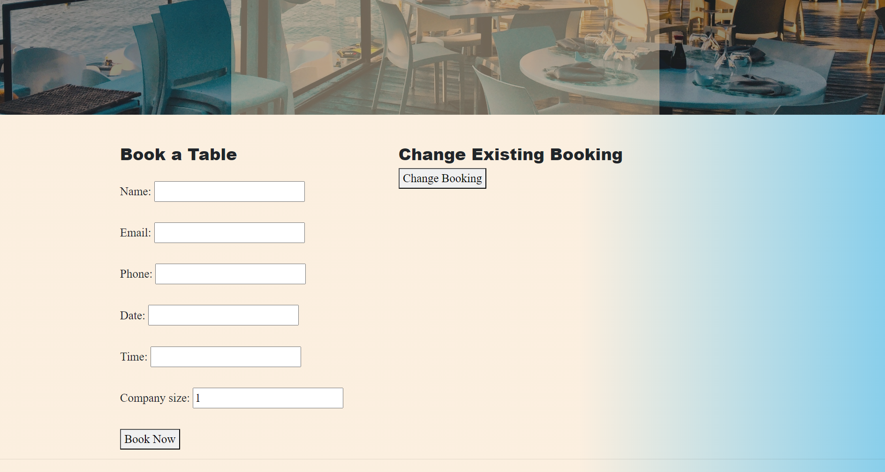

- If you create a new booking successfully, it will take you to this page that let's the visitor know their booking was successful.

  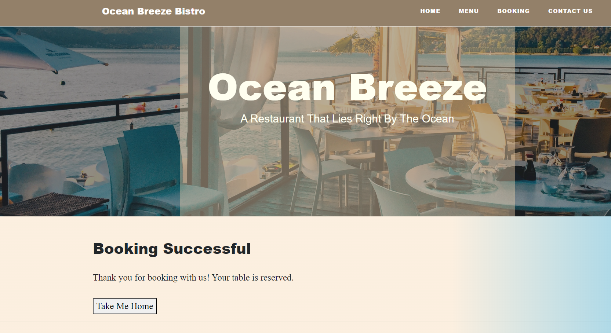

- If the visitor presses the "change existing booking" button, it will take you to this page where the visitor can chose which booking to edit or cancel if they have multiple bookings.

  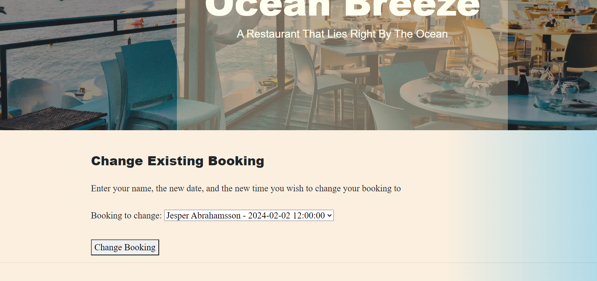

- If the visitor changes any information and then hits the "save changes" button, they will be taken to the page where it says your booking was successful.

  

- If the visitor elects to cancel their booking and it is successful, they will be taken to this page that confirms their booking to be canceled.

  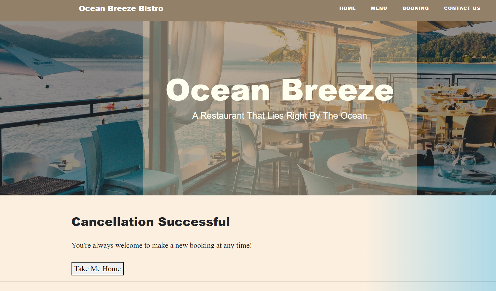

---

## Implementations & Accessability

### Future Implementations

- Add a possibility for users to recover their passwords on their own
- Add photos of the dishes on the menu page
- 

---

### Accessibility

In order to ensure that the website has good accessibility, I have used different semantic tags,
such as header, main, section, etc.

---

## Technologies Used

### Languages Used

I used HTML, CSS, JavaScript and the frameworks flask and Django to build this website.

### Local Development

Instructions on how to fork and clone the project.

#### How to Fork

1. Log in (or sign up) to Github.
2. Go to the repository for this project, (<https://github.com/Jesper941/OceanBreez.git>)
3. Click the Fork button in the top right corner.

#### How to Clone

Log in (or sign up) to GitHub.

1. Go to the repository for this project, (<https://github.com/Jesper941/OceanBreez.git>)
2. Click on the code button, select whether you want to clone with HTTPS, SSH, or GitHub CLI, and copy the link shown.
3. Open the terminal in your code editor and change the current working directory to the location you want to use for the cloned directory.
4. Type 'git clone' into the terminal and then paste the link you copied in step 3. Press enter.

## Testing

You can find all of the testing done in the [TESTING.md file](TESTING.md)

## Credits

Here i'm gonna list the credits to all the sources that helped me out during this project.

### Code Used

1. Some general tips and tricks from youtuber Brocode and his video: <https://www.youtube.com/watch?v=rHux0gMZ3Eg&t=40s>
2. For the forms, i took help from this website: <https://docs.djangoproject.com/en/5.0/topics/forms/>
3. I took a lot of help on how to work with flask and Django at the same time: <https://flask.palletsprojects.com/en/3.0.x/tutorial/>
4. For some help with my models, i took help from this site: <https://docs.djangoproject.com/en/5.0/topics/db/models/>
5. Most of the help came from the course material on the Code Institute website.
6. I again used my lovely girlfriend to help me make up a story and theme for the restaurant.
7. For some information about databases, i went here: <https://docs.djangoproject.com/en/5.0/ref/databases/>

### Content

I wrote the code myself but with some help from the sites and people mentioned above on how to execute my idea.

### Media

Background image in the base.html <https://unsplash.com/photos/a-restaurant-with-a-view-of-the-water-YYZU0Lo1uXE>

### Feedback

If you have any feedback or questions, please reach out to me via my email: Jesper941@hotmail.com
